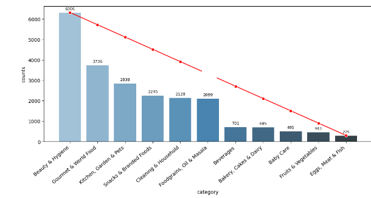
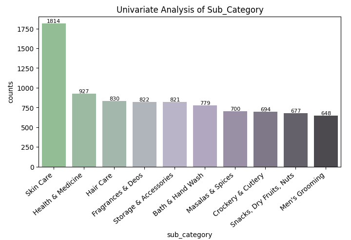
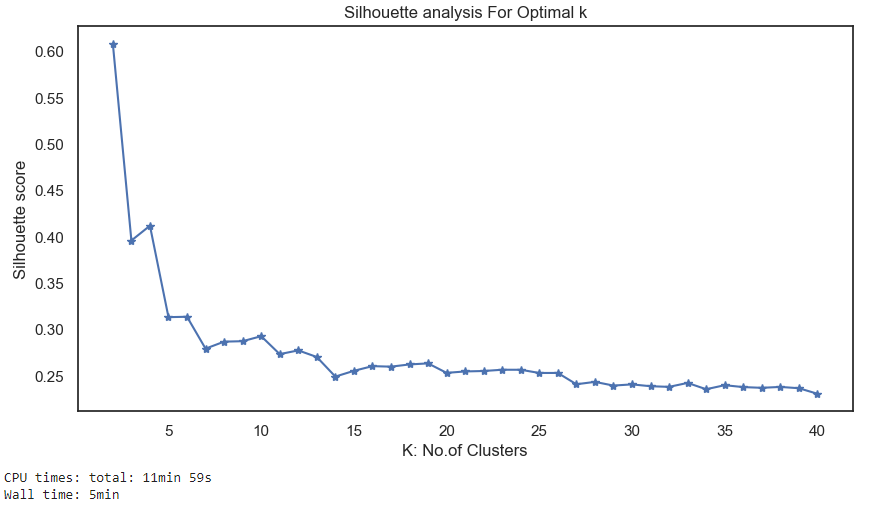
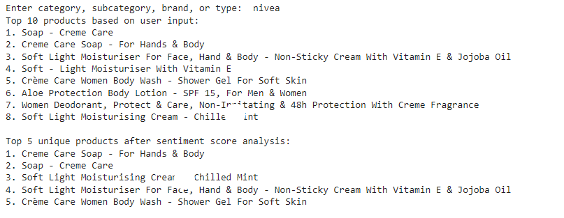

# Recommendation System

Robust product recommendation system using TF-IDF vectorization and sentiment analysis

## Dataset
This project utilizes the BigBasket Entire Product List (~28K datapoints) dataset from Kaggle, available [here](https://www.kaggle.com/datasets/surajjha101/bigbasket-entire-product-list-28k-datapoints). 


## Project Breif
Workflow:

Data Loading and Preprocessing: The code reads a dataset from a CSV file, performs initial data exploration, and removes rows with missing values in specific columns.

Exploratory Data Analysis (EDA): The notebook performs univariate analysis on different features like category, sub-category, brand, and type. Visualizations, including bar graphs and box plots, are generated to understand the distribution of these features.

Text Preprocessing: The code preprocesses the textual data in the 'description' column, including removing stopwords, special characters, and URLs.

Cluster Analysis: It applies KMeans clustering to numerical features and adds cluster labels to the dataset.

Named Entity Recognition (NER): The code utilizes SpaCy to perform NER on the description column, identifying entities like organizations, products, locations, etc.

TF-IDF Vectorization: The notebook vectorizes the description text using TF-IDF and computes TF-IDF weighted GloVe vectors for each description.

Recommendation System: The code provides functions for recommending products based on user input, leveraging cosine similarity between TF-IDF vectors.

Top Products: It calculates the top 10 products based on user input and sentiment scores, removing duplicates and sorting by compound sentiment.

Final Recommendations: The notebook prints the top 5 unique products after sentiment score analysis.

## Deployment

To deploy this project run

First clone the repo
   git clone https://github.com/codekid211/productRecomendations.git
   cd productRecomendations

Then install the following libraries
```python
pip install -r requirements.txt
```
After install all the dependencies 
```bash
- open cmd and run
- python productRecomendations.py
```

## Screenshots





## Contribution
If you have ideas for improvement or wish to contribute, please open an issue or submit a pull request. Collaboration is highly encouraged!